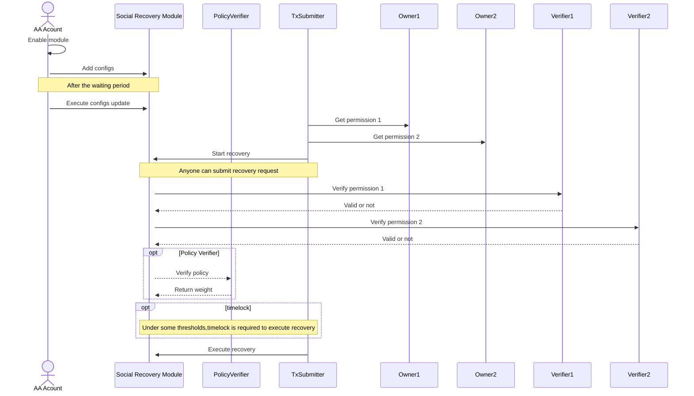

# **Social Recovery Interface**

The Social Recovery Interface is a reference implementation of ERC7093, integrating with the interface of the Safe Module.

In addition to implementing the logic of ERC7093, this reference implementation provides various Verifiers that can be used for social recovery, including Passkey, OpenID, Email, etc. It has also completed example tests, allowing users to securely use their Web2 accounts or devices as Guardians for their on-chain assets.

Features of this Social Recovery Interface:

- Supports arbitrary verification methods, greatly expanding the range of people who can participate in social recovery.
- Supports the configuration of multiple sets of Guardians simultaneously. A person may have different social circles, and these individuals may not know each other.
- For a set of Guardians, supports setting different time locks with different thresholds, balancing the security and usability of social recovery to some extent.
- Supports programming the weight of Guardians, enabling more complex social recovery logic.

**WARNING:** This is an proof-of-concept prototype and has not undergone careful code review. This implementation is NOT ready for production use.



## **Testing**

First, compile the contract:

```
$ forge compile
```

Then run the tests:

```
$ forge test --gas-report
```

## **Verifier**

The repository includes examples of Verifiers. Below is a brief explanation of these Verifiers. To generate the mock data required for Verifiers, you need to download [UniPassID/social_recovery_utils](https://github.com/UniPassID/social_recovery_utils).

### **OpenID**

OpenID is an identity authentication protocol involving three parties:

- User
- Relying party, or RP
- OpenID Provider, or OP

In a valid IdToken, the 'iss' indicates the OpenID Provider, 'sub' identifies the user, and 'aud' identifies the Relying party.

The OpenID Verifier needs to manage a set of public keys for verifying OpenID signatures and authorized Relying parties. This data can currently be managed through multisignature oracles, with a time lock to mitigate security risks.

The 'nonce' attribute of IdToken can be filled with the hash of the message to be signed, thereby implementing the functionality of binding the intent using IdToken.

Using **`social_recovery_utils`** and the following command, you can obtain mock data for the OpenID Verifier. Note that the '--create' option needs to be added for the first use to generate keys.

```
$ social_recovery_utils open-id --kid=test_kid --iss=test_issuer --aud=test_aud --nonce=0x1234 --sub=test_user
```

It returns something like:

```json
{
  "pk": "d1b83f8a96f95e42651b74bd506dc6f6e91f1da5efcc4751c9d5c4973ba3654f1ebfc5b4d3e1a75d05f90050a0c8c69f95fe9cf95d33005c2ce50141e8af13406d668f0f587e982e723c48f63a15435c70913856345d34bd05ff9d4854cb106d51d5294372550e742ef89372e77c94b5bf46d9216ddfd13646a3ba0d06d33f8b81e10c7b8864d314028a7ba74227dc5dd9c1828ce06bedaa0d58c5200c7c13c4581c8578a4504dfc6763039af65ff231651a03fe069a3e4f15800bc52f87a075007efd63b9d761fc9b1029ea6f04b2c3fc240cd69519c0e74df6166345bc30e9c5a23b1f929d7d065f91ce12d3c0377212d78a309add8c70a3b56b922814dd83",
  "kid": "test_kid",
  "iss": "test_issuer",
  "sub": "test_user",
  "aud": "test_aud",
  "nonce": "0x2490fd2489ed8da8de1e58c56a2e0fb400fb765013bb000a10456f452ff11384",
  "args": "0x0000003b00000046000000160000001e0000004f0000005800000061000000690000007400000007000000180000002c7b22616c67223a225253323536222c226b6964223a22746573745f6b6964222c22747970223a224a5754227d000000b87b22696174223a313730313432393837312c22657870223a313730313531363237312c226e6266223a313730313432393837312c22697373223a22746573745f697373756572222c22737562223a22746573745f75736572222c22617564223a22746573745f617564222c226e6f6e6365223a22307832343930666432343839656438646138646531653538633536613265306662343030666237363530313362623030306131303435366634353266663131333834227d00000100a87aa434d001edfeee6c8a536a4035a533b1ac41b1db16908a130164c8b0ffed4a9212813e0bd10721c7c6a99167f44280ee57fffc628b982080c12f54bfcf913bacd1c22738b2386dcbe8d269388c61f553f6d87ad436993387a7ead7cbd03d7933ddb3727b10e8a31e90e9134a602d11fc7d1bbfc0676c6fb4e67b0a5afc1c6e2e88b95469744f8313e6ed20bdfd5e409a1b1fea89bc64dc542e15af4b41391106d574c8812d7ada944be9b67364adb708f7fcae13a7728ded1248c4e16e76ca0956e2c2f229651af86035c7161c2e5d16c68a9527220de8d4198798baae64cfb3d361bac7639998d1a08d0e64e53ac592b1e86f7160c240595342a871e2ba"
}
```

Using the above parameters, you can construct mock data for the OpenID Verifier, where 'args' serves as the signature.

### **Email**

The DKIM protocol used by Email allows for on-chain verification of emails. By inserting the hash of the message to be signed into the 'Subject' field, verification involves extracting 'From', 'Subject', 'Selector', 'Domain', and 'Dkim-Signature'. The contract then selects the verification public key based on 'Selector' and 'Domain', verifies the correctness of 'Dkim-Signature', and verifies the intent based on 'Subject'.

The Email Verifier needs to manage a set of public keys for verifying DKIM signatures. This data can currently be managed through multisignature oracles, with a time lock to mitigate security risks.

Using **`social_recovery_utils`** and the following command, you can obtain mock data for the Email Verifier. Note that the '--create' option needs to be added for the first use to generate keys.

```
$ social_recovery_utils email --subject=0x2490fd2489ed8da8de1e58c56a2e0fb400fb765013bb000a10456f452ff11384 --selector=s2023 --domain=test.com --from=alice@test.com
```

It returns something like:

```json
{
  "pk": "a69e506330f22d05d609f3bd17803fb397585634c89ac8bbaa018ceecd1d8a51c75eb6d57889a1916a062aa4884b5c54b163d43cb46d84085987da27bc1537725ba18faf85cfff910ff0d4d96c1cd2fcaec0620820cc36b7a88940758552edd93f71979c7e103362675af392b2a24853f7f9a1008a3ed519fea9d591e5bbab948369e6acbe9a13ba0bfe28eff156a06b4b3d7a1fd6f7d386c10d303688240f626c8a9dbf2e77a19cb3d8e672282e2ac10b81eec6757683b2f3a8b48638bc6c2ad72b55131b2edaa861660a33bd9c827217d825124923f9bc7fbd8bee1ff45bcdb1c4a7060c2d91f054aa4945d9832e9eb0f5caf75a57b6db5631b9b1e6645d95",
  "from": "alice@test.com",
  "subject": "0x2490fd2489ed8da8de1e58c56a2e0fb400fb765013bb000a10456f452ff11384",
  "args": "0x00000000150000005f0000000000000005000000120000009e000000ce000000d3000000c2000000ca0000014c66726f6d3a616c69636540746573742e636f6d0d0a7375626a6563743a3078323439306664323438396564386461386465316535386335366132653066623430306662373635303133626230303061313034353666343532666631313338340d0a746f3a426f62203c626f6240746573742e636f6d3e0d0a646174653a4672692c2030312044656320323032332031313a33393a3039202b303030300d0a646b696d2d7369676e61747572653a763d313b20613d7273612d7368613235363b20643d746573742e636f6d3b20733d73323032333b20633d72656c617865642f72656c617865643b20713d646e732f7478743b20743d313730313433303734393b20683d66726f6d3a7375626a6563743a746f3a646174653b2062683d4f4e4c366e6d63494c4d524b7074326d7235326371714b54627059482b557031387564316b5a396f5969453d3b20623d000001000d5a66aaa398e599baa22e772c1742f8c6fcb1382d06d74f4d189df4c2aea07f0b1795690b897b2754adefaf3bbea7700e6b4607e149e280ae45f0f1ea6f89dd8bd1d2832b756969f5143fa7e74b5bfc02e0baa7305176d01e9a942f6dbe3bed1f01d6c49d67bf3f04b6870fb95e621d578252ced8a184db311870bdb42aa00d7da4bd5375329aadd453919fa0dffb256d4cbc73af59d20caa6f0ac74b0dd257afce5bfd6ef0ee3b31e62d8cd643f1488e01b19ab993dba01544be2f83de2b3e0089fbd000cb8993f65b7fd3e66dccdc4562d1b83969618eda58067b2b341dfe61def71f7b2da7fc710d58df390ccfee7fcd0ce219b483ce65899e62d47f6e05"
}
```

Using the above parameters, you can construct mock data for the Email Verifier, where 'args' serves as the signature.

### **Passkey**

Passkey is a new keyless login method that achieves identity authentication by generating a key in the user's trusted hardware. The Passkey Verifier can record the public key of the user's Passkey, thereby verifying the correctness of each Passkey signature. The hash of the message to be signed can be used as a Challenge for verification.

Using **`social_recovery_utils`** and the following command, you can obtain mock data for the Passkey Verifier.

```json
challenge: JJD9JIntjajeHljFai4PtAD7dlATuwAKEEVvRS_xE4Q
client_data_json: {"type":"webauthn.get","challenge":"JJD9JIntjajeHljFai4PtAD7dlATuwAKEEVvRS_xE4Q","origin":"https://passkey.test.com"}
{
  "q_x": "0xfb78ecf3e1e10557edec5f9d654e2e63825499a478bb98000418a16d7003c96f",
  "q_y": "0x5c00c2a273936ce4f99bd0eb057fc1e9c9d8d5284ecf374b5e5c5840fe924cae",
  "args": "0x0ccedfa5585f8475e44e61888232c6708eb667f390428715811987734f4d562edb12f5a59d3422b49008313fae614c160b57901f4b15ba9f5093e588268f5d3c00000025d636379c6ca019fe4b03b02a66222c9ce4526a3a3a22ed464ee63b50dda27ef61d00000000000000247b2274797065223a22776562617574686e2e676574222c226368616c6c656e6765223a2200000026222c226f726967696e223a2268747470733a2f2f706173736b65792e746573742e636f6d227d"
}
```

Using the above parameters, you can construct mock data for the Passkey Verifier, where 'args' serves as the signature.

## **Contribution**

Any contributions to this repository are welcome. For example, if you have ideas for other Verifiers or suggestions for improving the Social Recovery process, please submit an issue or PR.

## Security and Liability
----------------------
All contracts are WITHOUT ANY WARRANTY; without even the implied warranty of MERCHANTABILITY or FITNESS FOR A PARTICULAR PURPOSE.

## License
-------
All smart contracts are released under LGPL-3.0